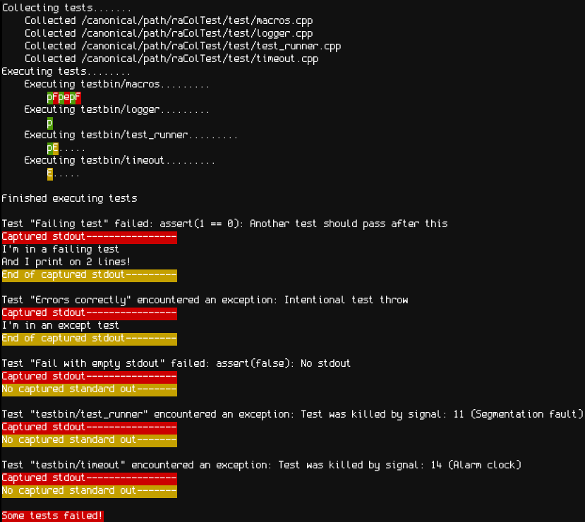

<h1>raColTest</h1>
<h2>Description</h2>
raColTest is a unit testing library made for C++. Future updates intend to make it compatible with C projects as well. Currently, it will only run on linux. Future expansion to posix and windows is planned.
   

<h2>Build from source</h2>
Run <code>make all</code> to build from source. Ensure tests are running as expected by running <code>./raColTest</code>. Expected output:   
If all tests perform as expected, run <code>make install</code> to place the raColTest executable in your path.  
 
<h2>Usage</h2>
<h3>Build</h3>
The included build system is capable of functioning with many other C or C++ projects.   
To use your own build system, any test code should be put in a directory at project root called "test". Each file in test should be compiled into it's own executable, each of which should be placed in a directory at project root called "testbin". 
 

<h3>Writing tests</h3>
Each test file should be placed in a directory called "test" at project root. They should each have a main function with the signature   <code>int main(int argc, char** argv)</code>. argv is used internally to track the name of the test file.  
All test files must include lib_raColTest/macros.h and every test must call TEST(), ASSERT(), and END_TEST in that order. Each test must be headed with <code>TEST(test_name)</code>, which declares needed variables and opens an exception safe testing environment. Next, write any needed test code. Following this, <code>ASSERT(conditional, description)</code>, which determines if the test has passed or failed based off of the conditional it is given, and logs test data. Any destructor code you may need should follow. Finally, a test is finalized with <code>END_TEST</code>.  
It is also important to note that all code between TEST() and END_TEST is within a local scope. Any values you would like to access outside of a test must be declared prior to opening the TEST() block.   
The files under test/ can be used as examples of test files.  
 
The files under src/lib_raColTest should be inculded in any project you would like to test, as raColTest requires them to build test executables. src/lib_raColTest/macros.h is the only stable interface with raColTest, but advanced users may interact with the contents of src/lib_raColTest/logger.h and src/lib_raColTest/logger.cpp if desired.

<h2>Examples</h2>
The included test/ directory can be used as an example of how to write tests with raColTest. For a more comprehensive example, see https://github.com/racoltdev/raColTest-Example-Project, which is a bare bones C++ project that includes tests written for raColTest and the required project setup to get raColTest to function correctly.
